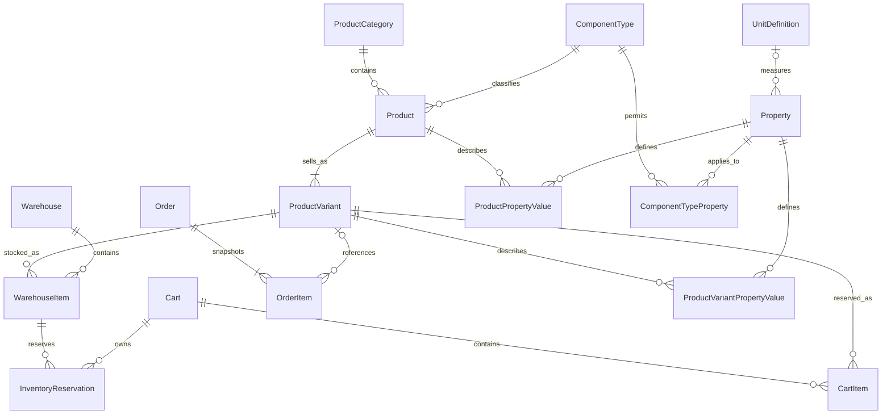

# DroneBuilder database model

The current migration history is a clean development baseline. It is not compatible
with databases created from the previous migration chain.

## Core model



- `Product` is the catalogue aggregate.
- `ProductVariant` is the sellable SKU and owns price and currency.
- The legacy product price and category API fields are mapped to the default SKU and
  normalized category.
- `WarehouseItem.Quantity` is physical stock.
- `WarehouseItem.ReservedQuantity` is a fast aggregate of active
  `InventoryReservation` records. Reservations identify the cart and cart item,
  expire after 30 minutes, and are released by a background service.
- Order items retain immutable product name, SKU, price, currency, and product ID
  snapshots. Their SKU relationship is nullable so order history survives catalogue
  cleanup.
- Shipping details are stored in structured columns and serialized to the existing
  JSON response field by the application mapping.

## Typed specifications

Product-level values and SKU-specific values are physically separated:

- `ProductPropertyValue` describes the catalogue product;
- `ProductVariantPropertyValue` describes a sellable SKU.

This prevents a variant belonging to one product from being paired with another
product ID. `Property.DataType` determines which value column is valid:

- `Text` → `ProductPropertyValue.TextValue`
- `Number` → `NumericValue`
- `Boolean` → `BooleanValue`
- `Option` → `ValueId`
- `NumericRange` → `MinNumericValue` and `MaxNumericValue`

Compatibility-relevant properties have stable `Code` values, canonical
`UnitDefinition` references, and `IsCompatibilityRelevant = true`.

The database enforces exactly one value representation and complete numeric
ranges. The domain layer additionally enforces the relationship between the value
column and `Property.DataType`, canonical units, single-value properties, and
allowed option values.

`ComponentTypeProperty` defines which properties are allowed for each component,
whether they are required, and whether they belong to the product or SKU level.
The baseline contains initial metadata for motors, frames, batteries, ESCs, and
flight controllers.

The database contains baseline units for length, area, mass, voltage, current,
power, electric charge, frequency, rotational speed, motor KV, cell count, and
temperature. `UnitAlias`, `PropertyAlias`, and `ValueAlias` support normalization
of scraped source names. `SpecificationAliasNormalizer` recognizes common
dimension formats such as `20x20`, `20×20 mm`, and `20mm x 20mm`.

Compatibility evaluation and drone build entities are intentionally not part of
this refactor.

## Import pipeline

Importers should not write unvalidated scraped data directly to catalogue tables.

```text
ImportSource
  -> ImportBatch
    -> ImportItem (raw JSONB)
      -> normalize and validate
        -> Product / ProductVariant / ProductPropertyValue
          -> ProductExternalReference
```

Product and SKU external references use separate tables, so a variant cannot be
linked to an unrelated product. `(ImportSourceId, ExternalId)` is unique within
each reference type, enabling idempotent upserts. `ImportItem.RawPayload`
preserves source data for retrying a normalizer after parsing rules change.

Importers should create products as inactive, populate required product and
variant specifications, ensure exactly one active default SKU, and only then
publish the product. `ApplicationDbContext` validates this publication invariant
on save.

## Recreating a development database

Back up anything important before resetting a database. To remove the compose
database volume explicitly:

```powershell
Copy-Item DroneBuilder/.env.example DroneBuilder/.env
# Fill every required value in DroneBuilder/.env before continuing.

docker compose --env-file DroneBuilder/.env -f DroneBuilder/docker-compose.yml down --volumes
docker compose --env-file DroneBuilder/.env -f DroneBuilder/docker-compose.yml up -d db
dotnet tool restore
dotnet ef database update `
  --project DroneBuilder/DroneBuilder.Infrastructure `
  --startup-project DroneBuilder/DroneBuilder.API
```

Do not use the volume-removal command against an environment containing data that
must be retained. Future schema changes must use forward-only migrations from
`InitialDomainBaseline`.

When running commands from the `DroneBuilder` directory, Compose loads
`DroneBuilder/.env` automatically:

```powershell
Copy-Item .env.example .env
# Fill every required value in .env.

docker compose config
docker compose up -d
```

The example maps the containerized PostgreSQL instance to host port `5433` to
avoid colliding with a PostgreSQL service already listening on the conventional
host port `5432`. Containers continue to communicate with the database over
`db:5432`.
